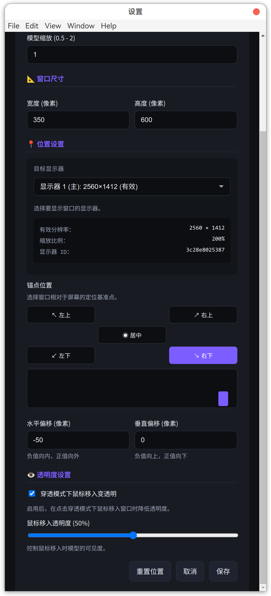

# Live2D Desktop Widget

Live2D 桌面摆件（Linux）

------

## 简介 / Introduction

**Live2D Desktop Widget** 是一个面向 **Linux 桌面环境** 的轻量级、可交互 Live2D 桌面摆件应用，支持 **Live2D Cubism 2.x（V2）** 本地模型渲染，适合长期常驻桌面显示。

本项目 **专注于 Live2D 本身**，不引入 AI 生成、自动行为或与模型无关的功能。
 所有设计均以 **不干扰用户日常使用** 为目标，例如通过点击穿透与半透明过渡，确保桌面操作的连续性与“纯粹”的使用体验。

**Live2D Desktop Widget** is a lightweight and interactive Live2D desktop widget designed for **Linux desktop environments**.
 It supports **local rendering of Live2D Cubism 2.x (V2) models** and is intended to run persistently on the desktop.

This project is **focused solely on Live2D itself**.
 It does **not introduce AI-based features, automatic behaviors, or unrelated functionality**.
 All design decisions aim to **preserve an unobtrusive and distraction-free desktop experience**, such as using click-through mode with smooth transparency transitions to avoid interfering with normal user interaction.

> 只是Live2D Just for Live2D.

------

## 功能特性 / Features

### 显示与交互 / Rendering & Interaction

- 支持本地 Live2D Cubism 2.x（V2）模型渲染
  Support local Live2D Cubism 2.x (V2) model rendering
- 全屏幕鼠标位置追踪（眼睛 / 头部跟随）
  Full-screen mouse tracking (eyes / head follow cursor)
- 模型显示区域点击交互
  Click interaction on model area
- 透明背景、无边框窗口
  Transparent background and frameless window
- 窗口置顶显示
  Always-on-top window support

------

### 智能显示器管理 / Smart Display Management

- **多显示器配置档案系统** — 每个显示器独立保存窗口位置和大小
  Multi-monitor profile system with independent settings per display
- **锚点定位系统** — 基于屏幕边角的智能定位（右下、右上、左下、左上、居中）
  Anchor-based positioning (bottom-right, top-right, bottom-left, top-left, center)
- **DPI 缩放自适应** — 自动适配显示器缩放比例变化
  Automatic DPI scaling adaptation
- **热插拔支持** — 自动响应显示器添加/移除/分辨率变化
  Hot-plug support with automatic repositioning
- **完整的调试日志** — 控制台输出详细的显示器信息和位置计算过程
  Comprehensive debug logging for display metrics and positioning

------

### 桌面集成 / Desktop Integration

- 系统托盘集成
  System tray integration
- 点击穿透模式（不影响桌面操作）
  Click-through mode (mouse events pass through)
- 穿透模式下鼠标移入自动变透明
  Auto transparency when mouse enters in click-through mode

------

### 配置与体验 / Configuration & UX

- **可视化设置窗口** — 图形化界面配置所有参数
  Visual settings window with GUI controls
- **位置预览功能** — 实时预览窗口在屏幕上的位置
  Live position preview in settings
- 支持模型选择、缩放、窗口尺寸、位置、透明度配置
  Model selection, scaling, window size, position and opacity control



- 配置持久化（重启后自动恢复）
  Persistent configuration across restarts
- 针对 Gnome 42 / Wayland 优化
  Optimized for Gnome 42 / Wayland

------

## 技术栈 / Tech Stack

- **Electron** — 跨平台桌面应用框架
  Cross-platform desktop application framework
- **Live2D Cubism SDK 2.x** — Live2D V2 模型渲染
  Live2D Cubism 2.x model rendering

------

## 安装 / Installation

```bash
# 安装依赖 / Install dependencies
npm install

# 启动应用 / Start application
npm start
```

------

## 使用方法 / Usage

1. 启动应用后，屏幕右下角会显示一个透明窗口
   After launch, a transparent window appears at the bottom-right of the screen
2. 右键点击系统托盘图标，选择「设置」
   Right-click the system tray icon and select “Settings”
3. 在设置窗口中可进行以下配置：
   Available options in the settings window:
   - **模型选择**（`model.json`）
     Model selection (`model.json`)
   - **模型缩放**（0.5–2.0）
     Model scaling (0.5–2.0)
   - **窗口尺寸**
     Window width and height
   - **窗口位置**（留空自动定位）
     Window position (auto if empty)
   - **自动变透明**（点击穿透模式）
     Auto transparency in click-through mode
   - **透明度控制**（0–100%）
     Opacity control (0–100%)
4. 点击「保存」应用设置
   Click “Save” to apply settings
5. 模型加载完成后会自动追踪鼠标位置
   Model automatically tracks mouse movement
6. 点击模型可触发互动效果
   Click the model to trigger interaction effects

------

## 系统托盘菜单 / System Tray Menu

- **显示 / 隐藏** — 切换窗口显示状态
  Show / Hide window
- **点击穿透** — 启用或关闭鼠标穿透
  Toggle click-through mode
- **重新加载** — 重载渲染页面
  Reload rendering page
- **开发者工具** — 打开 DevTools
  Open developer tools
- **设置** — 打开设置窗口
  Open settings window
- **退出** — 关闭应用
  Exit application

------

## 模型格式要求 / Model Format

支持 **Live2D Cubism 2.x** 模型，目录结构示例：

```
model/
├── model.json
├── model.moc
├── model.physics.json   # optional
└── textures/
    └── texture_00.png
```

------

## 项目结构 / Project Structure

```
live2d-desktop/
├── main.js                    # Electron main process
├── index.html                 # Main window
├── settings.html              # Settings window
├── package.json
├── scripts/
│   ├── app.js                 # Application logic
│   ├── live2d-renderer.js     # Live2D renderer
│   ├── settings.js            # Settings logic
│   └── display-manager.js     # Display manager (NEW)
├── styles/
│   └── main.css
├── lib/
│   └── live2d.min.js          # Live2D SDK
└── assets/
    └── icon.png
```

------

## 配置文件 / Configuration

配置文件默认路径：

```
~/.config/live2d-desktop/config.json
```

配置文件包含以下内容：

- 模型路径和缩放设置 / Model path and scaling settings
- 窗口尺寸 / Window dimensions
- 透明度设置 / Opacity settings
- **显示器配置档案** (displayProfiles) — 每个显示器的独立位置配置
  Display profiles — Independent position settings per display

示例配置

```json
{
  "modelPath": "/path/to/model.json",
  "modelScale": 1,
  "windowWidth": 350,
  "windowHeight": 600,
  "autoHideOnHover": false,
  "hoverOpacity": 0.1,
  "displayProfiles": {
    "3f4a1b2c8d9e": {
      "anchor": "bottom_right",
      "offsetX": -20,
      "offsetY": -50,
      "width": 350,
      "height": 600
    }
  }
}
```

------

## 适配说明 / Compatibility

- **测试环境** / Tested on:
  - Ubuntu 22.04.5 LTS + Gnome 42.9
  - X11
  - 多显示器环境 / Multi-monitor setups
  - 不同 DPI 缩放比例 / Various DPI scaling factors

- **支持的显示器配置** / Supported display configurations:
  - 单显示器 / Single monitor
  - 多显示器 / Multiple monitors
  - 热插拔 / Hot-plug
  - 动态 DPI 调整 / Dynamic DPI adjustment
  - 分辨率变化 / Resolution changes

> **缩放比例限制 / Scaling Limitation**
> 
> Electron/Chromium 在 Linux 环境下仅能识别 **整数倍缩放**（100%、200% 等）。
> 分数缩放（如 125%、150%、175%）会被近似为最接近的整数倍，可能导致显示器指纹变化或位置计算偏差。
> 这是 Chromium 的已知限制，非本应用问题。
>
> Electron/Chromium on Linux only recognizes **integer scaling factors** (100%, 200%, etc.).
> Fractional scaling (e.g., 125%, 150%, 175%) is approximated to the nearest integer, which may cause
> display fingerprint changes or position calculation deviations.
> This is a known Chromium limitation, not an issue with this application.

------

## 调试与日志 / Debugging & Logging

应用启动后会在控制台输出详细的调试信息：

The application outputs detailed debug information to the console:

- **显示器信息** — 分辨率、缩放因子、物理尺寸等
  Display information — Resolution, scale factor, physical dimensions
- **位置计算** — 锚点、偏移量、边界检查过程
  Position calculation — Anchor point, offset, boundary check
- **Canvas 调整** — DPI 适配和尺寸变化
  Canvas adjustment — DPI adaptation and size changes
- **显示器变化** — 热插拔和指标变化事件
  Display changes — Hot-plug and metrics change events

查看调试日志 / View debug logs:
1. 系统托盘 → 开发者工具
   System tray → Developer Tools
2. 查看 Console 标签
   Check Console tab

------

## 开发与调试 / Development & Debugging

```bash
# 启动开发模式 / Start development mode
npm start

# 打包 Linux AppImage / Build Linux AppImage
npm run dist
```

------

## 更新日志 / Changelog

**v2.0 — 显示器管理系统**

**新增功能：**

- 多显示器配置档案系统
- 基于锚点的窗口定位机制
- 设置界面实时位置预览
- DPI 缩放自适应
- 显示器热插拔支持
- 完整的显示器与位置调试日志

**改进内容：**

- 设置界面结构优化，参数配置更直观
- 窗口位置管理稳定性提升
- Canvas 尺寸调整逻辑优化

------

## 致谢与说明 / Acknowledgements & Notice

本项目基于以下开源项目进行实现与修改：

- **live2d-kanban-desktop**
  https://github.com/JimHans/live2d-kanban-desktop 

在原项目基础上，本项目针对 Linux 桌面环境与使用体验进行了调整与优化，
包括窗口交互行为、点击穿透与透明度过渡等设计。

部分代码修改与重构过程中使用了 AI 辅助工具。

This project is based on and derived from the following open-source project:

- **live2d-kanban-desktop** 
  https://github.com/JimHans/live2d-kanban-desktop

On top of the original implementation, this project introduces adjustments
and optimizations for Linux desktop environments, focusing on window behavior,
click-through interaction, and transparency transitions.

AI-assisted tools were used during parts of the refactoring and modification process.

---

## 许可证 / License

License: GNU General Public License v3.0

